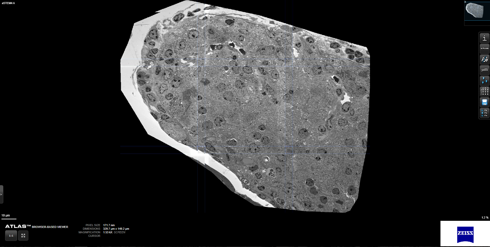

# Electron Tomography - Joint Reconstruction and Alignment Algorithm

This repository contains the implementation for our publication "A Joint Alignment and Reconstruction Algorithm for Electron Tomography to Visualize In-Depth Cell-to-Cell Interactions". Furthermore, it includes the browser link to visualize the NOD islet with scanning electron transmission microscopy (STEM). Electron tomography is an imaging modality based on transmission electron microscopy (TEM), where 3D reconstructions can be obtained from 2D projection images.

## Repository Structure
The repository is structured at follows:

* the base directory contains scripts to start pre-alignment or the joint reconstruction
* 'reco' includes the source files for the joint alignment and reconstruction and for pre-alignment of the projection data
* 'ops' contains custom PyTorch-Ops which need to be installed before running the joint alignment and reconstruction algorithm
* 'stem' includes the browser link for the NOD islet

## Dependencies

* pytorch >= 1.7
* astra-toolbox
* argparse
* Cuda

## Running the Algorithm

After installing all of the required dependencies above you need to install the provided modules to your python environment. This can be done with

~~~
cd ops
python setup.py install
~~~

The joint alignment and reconstruction algorithm can either be started directly or after a pre-alignment of the projection data has been done. This can be achieved by running the following scripts.

~~~
run_prealign.sh
run_reco.sh
~~~

## Scanning Transmission Electron Microscopy (STEM)

To open the STEM atlas link, please open the [html link](stem/) after cloning the repository locally. 
