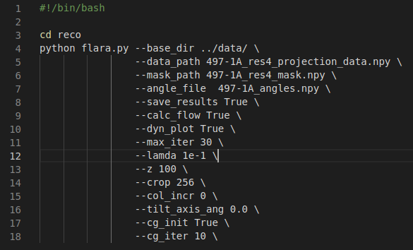
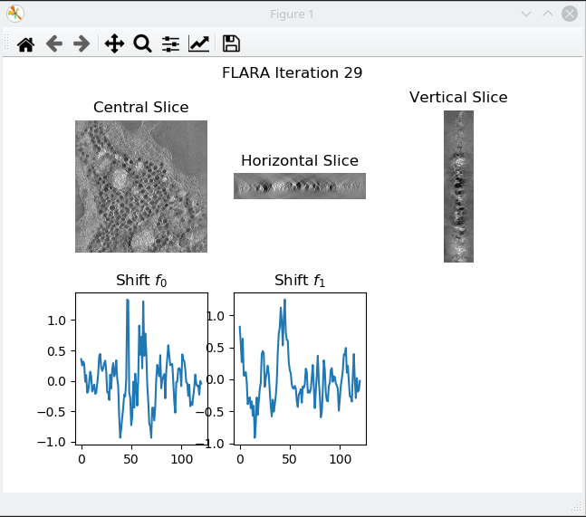

# Fiducial-Less Alignment and Reconstruction Algorithm for Electron Tomography (FLARA)

This repository contains the implementation for the algorithm FLARA, presented in our publication "A Joint Alignment and Reconstruction Algorithm for Electron Tomography to Visualize In-Depth Cell-to-Cell Interactions". Furthermore, it includes the browser link to visualize the NOD islet with scanning electron transmission microscopy (STEM). Electron tomography is an imaging modality based on transmission electron microscopy (TEM), where 3D reconstructions can be obtained from 2D projection images.

If this is useful to you, please cite

```
@article{bogensperger2022joint,
  title={A joint alignment and reconstruction algorithm for electron tomography to visualize in-depth cell-to-cell interactions},
  author={Bogensperger, Lea and Kobler, Erich and Pernitsch, Dominique and Kotzbeck, Petra and Pieber, Thomas R and Pock, Thomas and Kolb, Dagmar},
  journal={Histochemistry and Cell Biology},
  pages={1--12},
  year={2022},
  publisher={Springer}
}
```

## Repository Structure
The repository is structured at follows:

* the base directory contains scripts to start pre-alignment or the joint reconstruction
* 'reco' includes the source files for the joint alignment and reconstruction and for pre-alignment of the projection data
* 'ops' contains custom PyTorch-Ops which need to be installed before running the joint alignment and reconstruction algorithm
* 'stem' includes the browser link for the NOD islet
* 'data' containing a sample tomographic dataset, that is already prealigned 

## Dependencies

* pytorch 1.7
* astra-toolbox 1.9
* argparse
* Cuda 10.2
* argparse
* matplotlib
* scikit-image
* mrcfile

## Running the Algorithm

After installing all of the required dependencies (ensure that cuda versions match when installing pytorch and astra) above you need to install the provided modules to your python environment. This can be done with

~~~
cd ops
python setup.py install
~~~

The joint alignment and reconstruction algorithm FLARA can either be started directly or after a pre-alignment of the projection data has been done. This can be achieved by running the following scripts. Make sure you add the paths containing the projection data, masks from pre-alignment and tilt angles and related settings before executing the scripts.

~~~
run_prealign.sh
run_reco.sh
~~~

The sample tomographic dataset contains prealigned projection data that can be directly used to test the algorithm. The dataset is resized and stored in only half-precision due to size limitations in this repository to allow for testing of the algorithm. A setup with exemplary parameters might look as follows, where 30 iterations of FLARA are executed after an initial guess is estimated with a Conjugate Gradient (CG) algorithm. The parameter lamda governs the influence of the regularization term. 

 


Setting dyn_plot to True allows to track the current reconstruction and shift computation iteratively. 




## Scanning Transmission Electron Microscopy (STEM)

To open the STEM atlas link, please open the [html link](stem/) after cloning the repository locally. 

